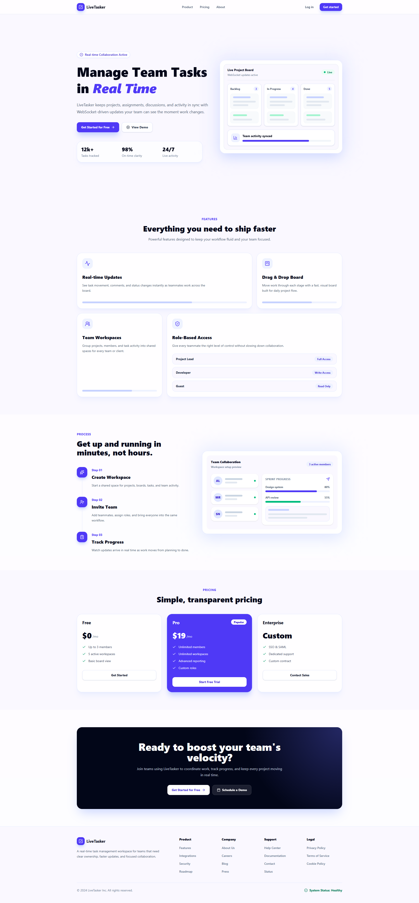
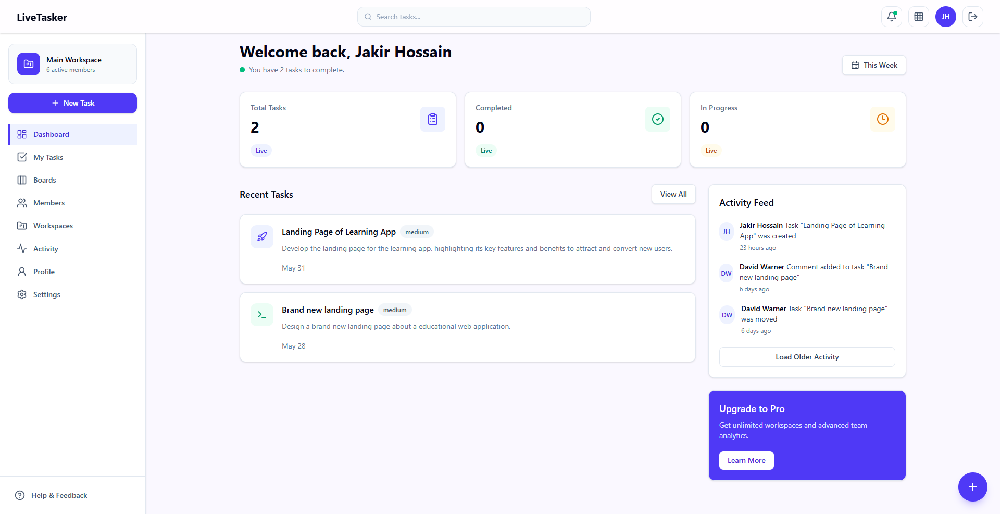
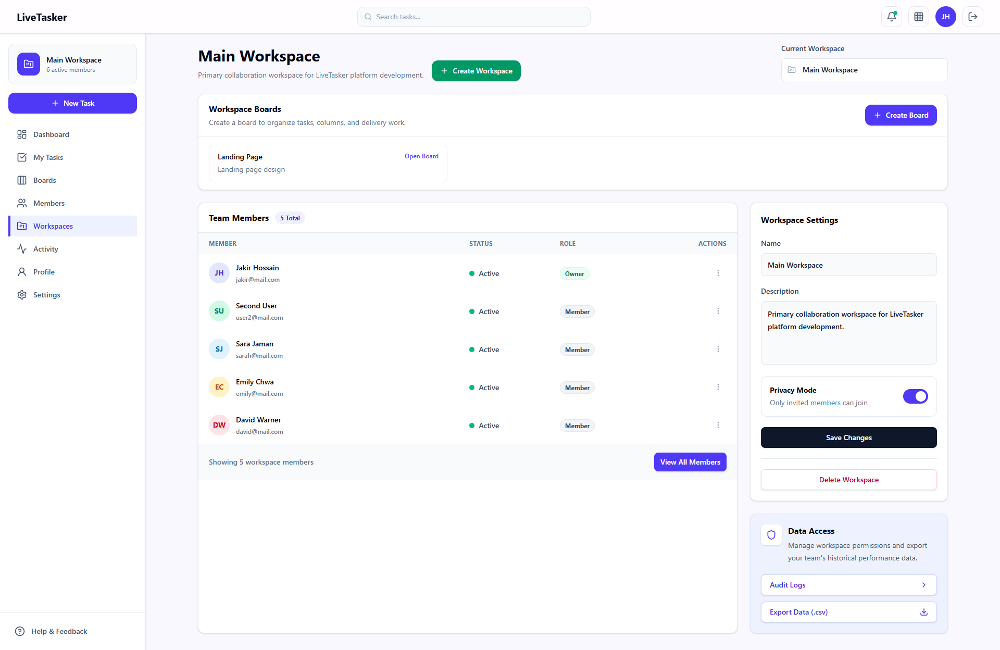
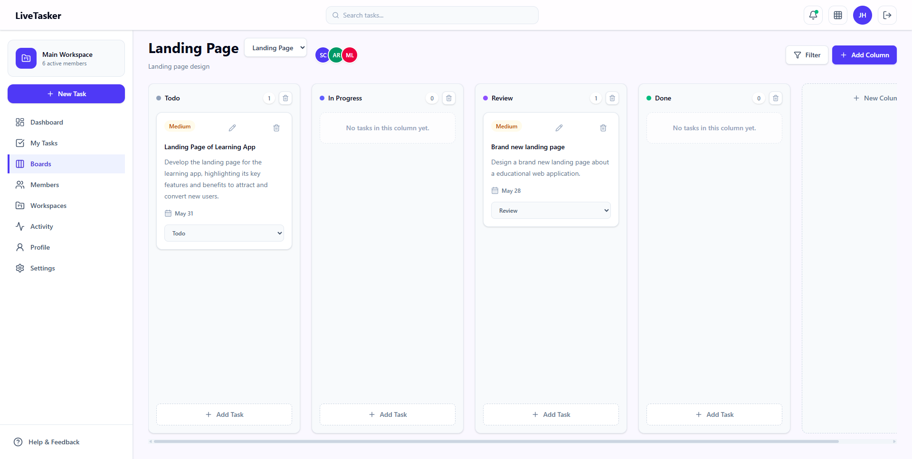
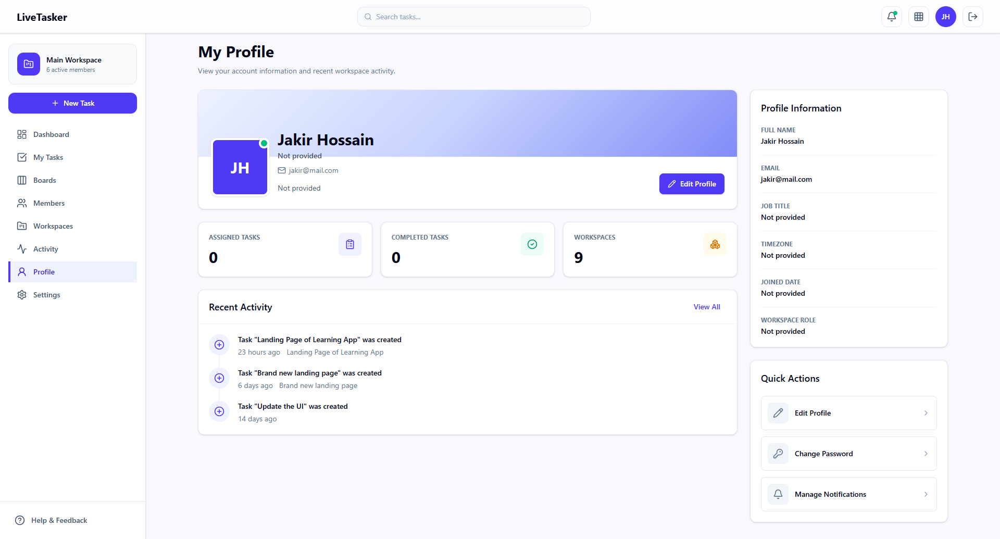

# 🚀 LiveTasker

<p align="center">
  
  
  
  
  
  
</p>

<p align="center">
  <strong>A Real-Time Team Collaboration & Task Management Platform</strong>
</p>

<p align="center">
  Organize workspaces, manage projects, assign tasks, track progress, and collaborate with your team in real time.
</p>

---

## 🌐 Live Demo

### Frontend

https://live-tasker.vercel.app

### Backend API

https://livetasker-server.onrender.com

### GitHub Repository

https://github.com/Jakirhossain80/live-tasker

---

# 📖 Project Overview

LiveTasker is a modern full-stack MERN application designed to improve team productivity and collaboration. The platform enables teams to create workspaces, manage projects through Kanban-style boards, assign tasks, monitor activity, and collaborate in real time.

The application leverages Socket.IO for instant updates, JWT-based authentication for secure access, MongoDB for scalable data storage, and a responsive React-based frontend for an excellent user experience.

LiveTasker demonstrates modern software engineering practices including:

* Real-time communication
* Authentication & authorization
* Protected routes
* Modular architecture
* TypeScript on both frontend and backend
* State management
* Error boundaries
* Loading states
* Responsive design

---

# ✨ Features

## 🔐 Authentication & Security

* User Registration
* User Login
* JWT Authentication
* JWT Authorization
* Protected Routes
* Secure Password Hashing with bcrypt

## 🏢 Workspace Management

* Create Workspaces
* Manage Workspaces
* Workspace Ownership
* Workspace Collaboration

## 👥 Member Management

* Invite Members
* Manage Workspace Members
* Team Collaboration

## 📋 Task Management

* Create Tasks
* Update Tasks
* Delete Tasks
* Assign Tasks
* Manage Priorities
* Due Date Management

## 📌 Kanban Board

* To Do
* In Progress
* Review
* Completed

## ⚡ Real-Time Features

* Real-Time Task Updates
* Real-Time Board Updates
* Instant Workspace Synchronization
* Socket.IO Integration

## 📈 Activity Tracking

* Task Activities
* Workspace Activities
* Member Activities
* Activity Timeline

## 👤 User Profile

* Profile Management
* Personal Dashboard
* User Information Management

## 🎨 User Experience

* Responsive Design
* Loading States
* Toast Notifications
* Error Boundaries
* Modern UI

---

# 🛠 Technology Stack

## Frontend

* React.js
* Vite
* TypeScript
* Tailwind CSS
* React Router DOM
* Zustand
* Axios
* Socket.IO Client
* React Hot Toast

## Backend

* Node.js
* Express.js
* TypeScript
* MongoDB
* Mongoose
* JWT
* Socket.IO
* bcrypt

## Deployment

### Frontend

* Vercel

### Backend

* Render

### Database

* MongoDB Atlas

---

# 📸 Screenshots

## Landing Page



---

## Dashboard



---

## Workspace Management



---

## Task Board



---

## User Profile



---

# ⚙️ Installation Guide

## Clone Repository

```bash
git clone https://github.com/Jakirhossain80/live-tasker.git

cd live-tasker
```

---

# 🔑 Environment Variables Setup

## Backend (.env)

```env
PORT=5000

MONGO_URI=your_mongodb_connection_string

CLIENT_URL=http://localhost:5173

JWT_ACCESS_SECRET=your_access_secret

JWT_REFRESH_SECRET=your_refresh_secret

JWT_ACCESS_EXPIRES_IN=15m

JWT_REFRESH_EXPIRES_IN=7d

GEMINI_API_KEY=your_gemini_api_key
```

---

# 🎨 Frontend Setup

Navigate to client directory:

```bash
cd client
```

Install dependencies:

```bash
npm install
```

Run development server:

```bash
npm run dev
```

Frontend runs on:

```txt
http://localhost:5173
```

---

# 🚀 Backend Setup

Navigate to server directory:

```bash
cd server
```

Install dependencies:

```bash
npm install
```

Run development server:

```bash
npm run dev
```

Backend runs on:

```txt
http://localhost:5000
```

---

# ▶️ Running The Project Locally

### Terminal 1

```bash
cd server
npm run dev
```

### Terminal 2

```bash
cd client
npm run dev
```

Open:

```txt
http://localhost:5173
```

---

# 📂 Folder Structure Overview

```txt
live-tasker
│
├── client
│   ├── src
│   │   ├── api
│   │   ├── assets
│   │   ├── components
│   │   ├── hooks
│   │   ├── layouts
│   │   ├── pages
│   │   ├── routes
│   │   ├── sockets
│   │   ├── store
│   │   └── types
│   │
│   └── package.json
│
├── server
│   ├── src
│   │   ├── config
│   │   ├── controllers
│   │   ├── middleware
│   │   ├── models
│   │   ├── routes
│   │   ├── services
│   │   ├── socket
│   │   ├── types
│   │   └── utils
│   │
│   └── package.json
│
└── README.md
```

---

# 🔌 API Overview

### Authentication

```txt
POST   /api/auth/register
POST   /api/auth/login
POST   /api/auth/logout
GET    /api/auth/me
```

### Workspaces

```txt
GET    /api/workspaces
POST   /api/workspaces
PUT    /api/workspaces/:id
DELETE /api/workspaces/:id
```

### Boards

```txt
GET    /api/boards
POST   /api/boards
PUT    /api/boards/:id
DELETE /api/boards/:id
```

### Tasks

```txt
GET    /api/tasks
POST   /api/tasks
PUT    /api/tasks/:id
DELETE /api/tasks/:id
```

### Activities

```txt
GET /api/activities
```

---

# 🔐 Authentication Flow

1. User registers or logs in.
2. Backend validates credentials.
3. JWT token is generated.
4. Token is stored securely.
5. Protected routes verify JWT.
6. Authorized users access resources.

---

# ⚡ Real-Time Features Overview

LiveTasker uses Socket.IO for real-time collaboration.

### Real-Time Events

* Task Creation
* Task Updates
* Task Assignment
* Status Changes
* Activity Updates
* Workspace Updates

Benefits:

* Instant synchronization
* Improved collaboration
* Better user experience
* Reduced manual refreshes

---

# 🔮 Future Improvements

* Role-Based Permissions
* Workspace Analytics
* Team Reports
* Email Notifications
* Push Notifications
* Calendar Integration
* File Attachments
* Advanced Search & Filters
* AI Task Suggestions
* Mobile Application

---

# 🎯 Challenges & Learning Outcomes

## Challenges

* Implementing real-time communication
* Managing complex state
* Authentication & authorization
* Workspace collaboration architecture
* Socket.IO synchronization
* Protected route management

## Learning Outcomes

* Full-Stack MERN Development
* TypeScript Architecture
* Real-Time Systems
* JWT Authentication
* State Management
* API Design
* Deployment & DevOps
* Team Collaboration Features

---

# 👨‍💻 Author

### Md. Jakir Hossain

MERN Stack Developer

* GitHub: https://github.com/Jakirhossain80
* LinkedIn: https://www.linkedin.com/in/jakirhossain80
* Portfolio: https://jakir-dev.netlify.app

---

# 🔗 Repository

GitHub Repository:

https://github.com/Jakirhossain80/live-tasker

---

# 📜 License

This project is licensed under the MIT License.

You are free to use, modify, and distribute this project for personal and educational purposes.

---

## ⭐ Support

If you found this project helpful, please consider giving it a star on GitHub.

⭐ Star the repository:
https://github.com/Jakirhossain80/live-tasker

---

<p align="center">
  Made with ❤️ using the MERN Stack, TypeScript, Socket.IO, and Modern Web Technologies.
</p>
